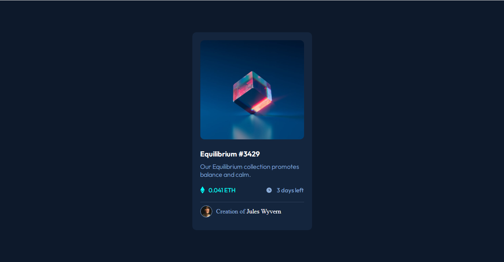

# Frontend Mentor - NFT preview card component solution


## Overview



This repository contains a simple NFT preview card component built with HTML and CSS. 
The component utilizes flexbox for layout and includes hover effects to enhance user interaction.


## Links
- Live Site URL: [NFT Preview card](https://your-live-site-url.com)

## Features

- Flexbox Layout: The component is structured using flexbox, ensuring a flexible 
  and responsive design.
- Hover Effects: When a user hovers over the NFT image, a subtle effect is applied 
  to provide visual feedback.


### Built with

- Semantic HTML5 markup
- CSS custom properties
- Flexbox

## Usage

To use this component in your project, follow these steps:

1. Clone the Repository:

```bash
  git clone https://github.com/your-username/nft-preview-card.git
```

2. Navigate to the Project Directory:

```bash
  cd nft-preview-card
```

3. Open the HTML File:

Open `index.html` in your preferred browser to see the component in action.

## License

This project is open-source and available under the MIT License.


## Author
Kingsley
- Twitter - [Kingsley](https://x.com/_kingsl3y)


## Acknowledgments

Frontend Mentor (Design)

